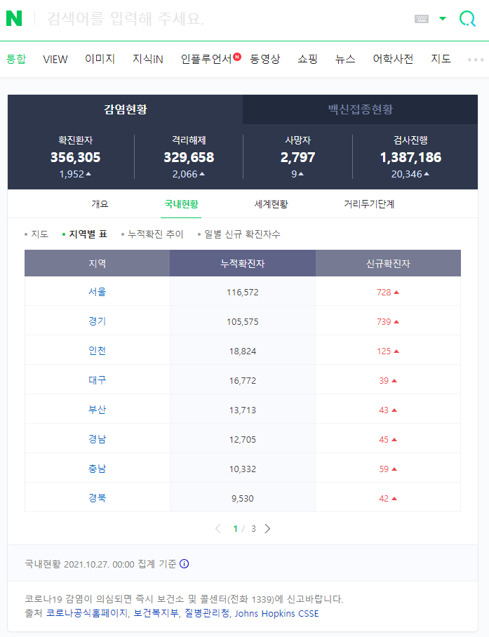
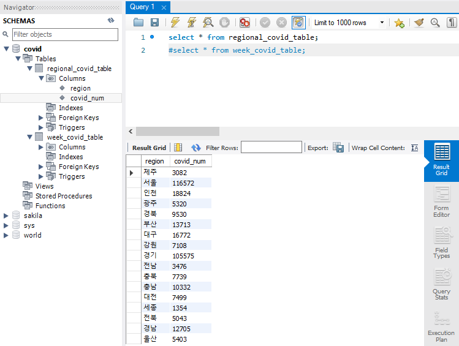
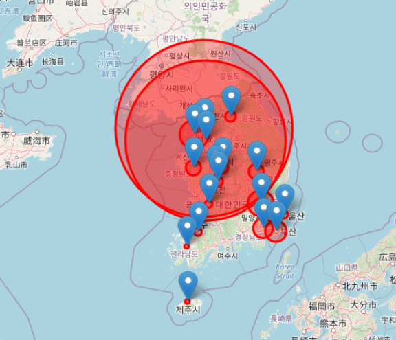
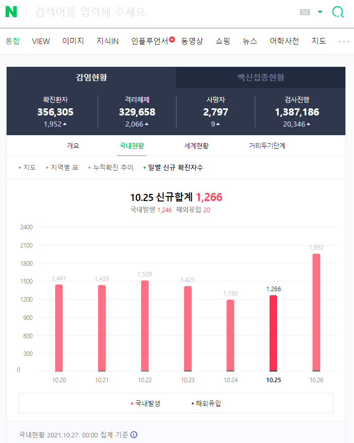
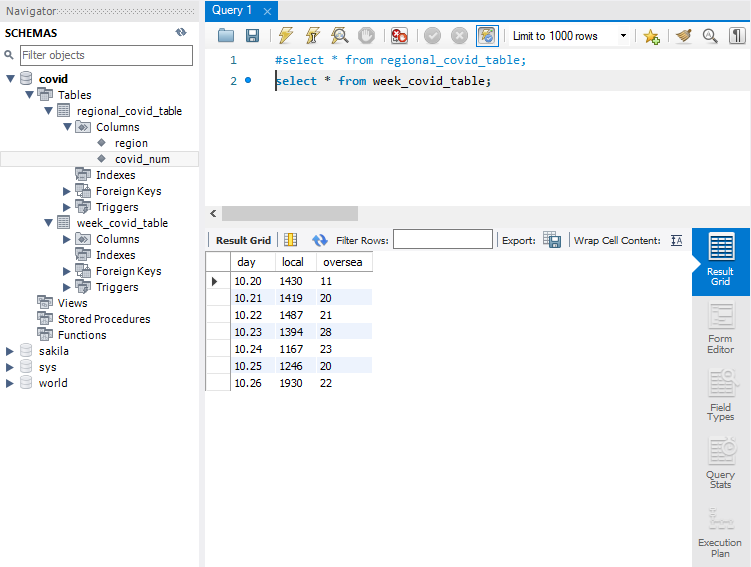
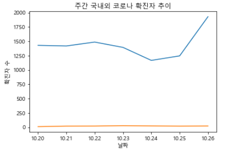

# Satistical Analyze Aroject Related To COVID-19 

### 1. Contents  
    1) It let us know COVID-19 Confirmed number from certain websites.  
    2) It can visualize COVID-19 confirmed number on Map or graph weekly.  

### 2.Setting
    1) Should be installed MySQL DBMS and set server settings, schema.  
    2) Needed Pymysql, Selenium, Beautifulsoup, Pandas, Folium, Requests, Matplotlib, Openpyxl library.  
    3) Needed kakao api for using quilification and input private API REST KEY in code.  
    4) Download proper version of Chrome Web Driver to use Selenium for crawling.(https://chromedriver.chromium.org/downloads)  

### 3. File1: data_preprocessing_and_save Process  
    1) Web crawling from naver web sites.  
    2) Save data to MySQL DBMS.  

### 4.File2: data_visualiztion_from_MySQL Process  
    1) Read data from MySQL DBMS.  
    2) Make COVID-19 confirmed map on kakao map using kakao API.  
    3) Make weekly COVID-19 confirmed transition graph with Matplotlib library.  

### 5. Language  
    1) Python  
    2) SQL  
   
### 6. Result  
    1) Regional(from, out)  
  
  
  

    2) Weekly(from, out)  
  
  
  
